# subst

 

## Renames files matched by regexp

**GENERAL:**

subst is a script that renames files (much like the script called \"rename\", except it also matches files by a regexp). You have to be in the directory where you want to rename files.
  
**SYNOPSIS:**

    subst [ -h ] [ -v ] [ -f ] [ FILES ] MATCH SUBSTITUTION

**OPTIONS:**

    Use -h for help.
    Use -v for verbose output.
    Use -f to force overwriting of files 
	(note that this option can overwrite renamed
	files by files that are later renamed)

**MATCHES:**

    FILES is the regexp that matches the filenames to be renamed.
	If you skip this option, it matches all the files in the
	directory (same as using the regexp /.*/).
    MATCH is the regexp that matches within the filename.
    SUBSTITUTION is the regexp used for substituting the match.

## License
This software is released into the Public Domain.
